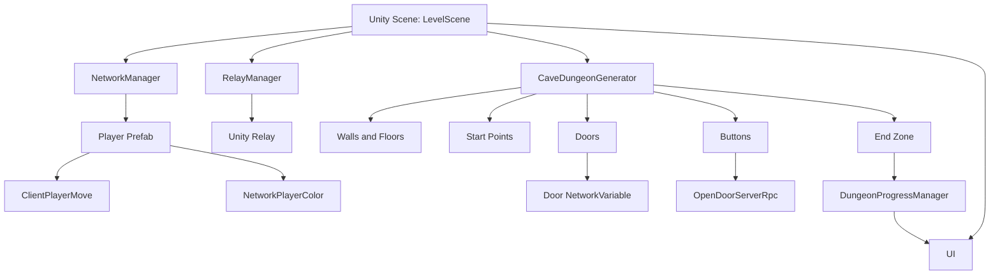
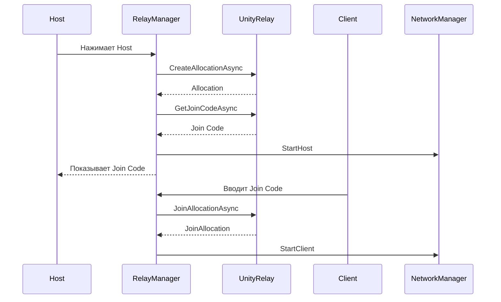

# Дипломная работа

## Тема

Разработка многопользовательской 3D-игры-лабиринта на Unity с процедурной генерацией уровней и сетевым взаимодействием через Unity Netcode и Relay.

## Краткое описание проекта

Проект Maze2.0 представляет собой Unity-приложение, в котором игроки проходят процедурно сгенерированный лабиринт. Основная идея работы - создать игровой прототип с кооперативным прохождением, где уровень строится автоматически, игроки подключаются по сетевому коду, а игровые объекты синхронизируются между участниками сессии.

В проекте реализованы:

- процедурная генерация лабиринтов и cave dungeon-уровней;
- разделение стартовых позиций для игроков;
- центральная зона выхода;
- двери и кнопки с перекрестной логикой взаимодействия;
- сетевой запуск host/client через Unity Relay;
- синхронизация игроков, дверей, платформ и визуальных состояний через Unity Netcode for GameObjects;
- пользовательский интерфейс для создания и подключения к комнате;
- вспомогательные механики: движущиеся платформы, падающие платформы, телепортация, камера, цвет игрока, зона завершения.

## Цель работы

Разработать многопользовательскую 3D-игру-лабиринт на Unity, в которой уровни создаются процедурно, а несколько игроков могут подключаться к одной игровой сессии и совместно проходить уровень через сетевое взаимодействие.

## Задачи работы

- Изучить методы процедурной генерации лабиринтов и игровых уровней.
- Проанализировать возможности Unity для создания 3D-игр и сетевого взаимодействия.
- Спроектировать архитектуру игрового приложения.
- Реализовать алгоритм генерации лабиринта.
- Реализовать cave dungeon-генератор с двумя стартовыми зонами, центральным коридором, дверями, кнопками и выходом.
- Настроить сетевую архитектуру host/client с использованием Unity Netcode for GameObjects.
- Реализовать подключение игроков через Unity Relay.
- Реализовать синхронизацию ключевых игровых объектов.
- Разработать пользовательский интерфейс для запуска и подключения к сетевой комнате.
- Провести тестирование основных игровых сценариев.
- Оценить результат и определить направления дальнейшего развития проекта.

## Объект и предмет исследования

Объект исследования: процесс разработки многопользовательских 3D-игр в среде Unity.

Предмет исследования: методы процедурной генерации игровых лабиринтов и организация сетевого взаимодействия игроков в Unity-проекте.

## Практическая значимость

Практическая значимость работы состоит в создании игрового прототипа, который может быть использован как основа для дальнейшей разработки кооперативной игры, учебного проекта по Unity или демонстрационного приложения для изучения процедурной генерации и сетевых механик.

## Технологический стек

| Компонент | Использование в проекте |
| --- | --- |
| Unity | Основная среда разработки игры |
| C# | Реализация игровой логики |
| Unity Netcode for GameObjects | Сетевая синхронизация объектов и игроков |
| Unity Relay | Подключение игроков по join code |
| Unity Transport | Транспортный слой сетевого взаимодействия |
| Unity Input System | Обработка пользовательского ввода |
| Cinemachine | Работа с камерой |
| TextMesh Pro | Отображение текста и UI |
| Universal Render Pipeline | Графическая подсистема проекта |
| Starter Assets Third Person Controller | Базовое управление персонажем |

## Структура дипломной работы

## Введение

### Актуальность темы

В этом разделе раскрывается, почему тема разработки многопользовательских игр остается актуальной. Нужно описать рост популярности кооперативных игр, значение процедурной генерации для повышения вариативности игрового процесса и роль Unity как доступной платформы для создания 3D-приложений.

### Проблематика

Основная проблема состоит в необходимости объединить несколько сложных подсистем: генерацию уровня, управление игроком, сетевое подключение, синхронизацию объектов и игровую логику завершения уровня. Каждая из этих подсистем должна работать не отдельно, а как часть единого игрового процесса.

### Цель и задачи работы

Здесь приводятся цель и задачи, указанные выше, в академической форме.

### Объект и предмет исследования

Описываются объект и предмет исследования.

### Методы исследования и разработки

В работе используются:

- анализ существующих подходов к генерации лабиринтов;
- проектирование архитектуры игрового приложения;
- объектно-ориентированное программирование на C#;
- прототипирование игровых механик в Unity;
- практическое тестирование host/client-сценариев;
- анализ корректности генерации и сетевой синхронизации.

### Структура работы

Дипломная работа состоит из введения, трех основных глав, заключения, списка источников и приложений.

## Глава 1. Теоретические основы разработки многопользовательской 3D-игры

### 1.1. Особенности разработки 3D-игр

В разделе описываются базовые элементы 3D-игры: сцена, игровые объекты, компоненты, физика, камера, материалы, префабы и пользовательский ввод.

### 1.2. Игровой движок Unity

Нужно раскрыть возможности Unity: компонентная архитектура, работа со сценами, система префабов, инспектор, MonoBehaviour, жизненный цикл скриптов, пакеты Unity Package Manager.

### 1.3. Процедурная генерация уровней

Раздел посвящен процедурной генерации как способу автоматического создания игровых пространств. Следует описать преимущества: повторное прохождение, вариативность, экономия ручного труда при создании уровней.

### 1.4. Алгоритмы генерации лабиринтов

Основной алгоритм проекта связан с рекурсивным прорезанием проходов. В разделе можно описать:

- представление уровня в виде двумерной матрицы;
- разделение клеток на стены и проходы;
- выбор случайных направлений;
- рекурсивное продвижение по сетке;
- формирование связного лабиринта.

### 1.5. Основы сетевого взаимодействия в играх

Нужно объяснить модели client-server и host-client. В проекте используется host-client: один игрок запускает сессию как хост, другие подключаются как клиенты.

### 1.6. Unity Netcode for GameObjects

Раздел описывает ключевые понятия:

- NetworkObject;
- NetworkBehaviour;
- NetworkVariable;
- ServerRpc;
- ClientRpc;
- владение объектами;
- серверная авторитетность.

### 1.7. Unity Relay

В разделе объясняется назначение Relay: подключение игроков без прямой настройки портов и IP-адресов. Хост создает allocation, получает join code, клиент вводит код и подключается к сессии.

### Выводы по главе 1

В первой главе рассмотрены теоретические основы разработки 3D-игр, процедурной генерации и сетевой синхронизации. Эти понятия используются далее при проектировании и реализации Maze2.0.

## Глава 2. Проектирование игры Maze2.0

### 2.1. Общая концепция игры

Maze2.0 - это кооперативная 3D-игра-лабиринт. Игроки появляются в разных частях уровня, исследуют лабиринт, взаимодействуют с кнопками и дверями, после чего должны добраться до зоны выхода.

### 2.2. Игровой сценарий

Базовый сценарий:

1. Игрок запускает приложение.
2. Один пользователь создает комнату как host.
3. Приложение получает join code через Unity Relay.
4. Второй пользователь вводит код и подключается как client.
5. Сервер генерирует уровень.
6. Игроки появляются в разных стартовых точках.
7. Игроки проходят свою часть лабиринта.
8. Игроки активируют кнопки, открывающие двери другой стороны.
9. Игроки достигают центральной зоны выхода.
10. Игра фиксирует завершение уровня.

### 2.3. Архитектура проекта

Проект состоит из следующих основных частей:

| Подсистема | Основные скрипты | Назначение |
| --- | --- | --- |
| Генерация лабиринта | MazeGenerator.cs | Создание простого лабиринта на основе сетки |
| Генерация dungeon-уровня | CaveDungeonGenerator.cs | Создание сетевого уровня с двумя сторонами, дверями, кнопками и выходом |
| Сетевое подключение | RelayManager.cs, NetworkManagerUI.cs | Создание и подключение к комнате |
| Голосовая связь | VoiceManager.cs, RelayManager.cs | Подключение игроков к общему voice-каналу Vivox и управление микрофоном |
| Игрок | ClientPlayerMove.cs, NetworkPlayerColor.cs, PlayerCameraBinder.cs, CameraFollow.cs | Управление локальным игроком, камера, цвет |
| Интерактивные объекты | Door.cs, Button.cs | Открытие дверей через кнопки |
| Лазерные ловушки | LaserTrap.cs, LaserSwitch.cs | Блокировка прохода к целевому объекту и отключение лазера с противоположной стороны |
| Завершение уровня | EndZoneTrigger.cs, DungeonProgressManager.cs, DungeonUI.cs | Проверка игроков в зоне выхода и отображение прогресса |
| Платформы | NetworkFallingPlatform.cs, OscillatingPlatform.cs, PlatformTrigger.cs | Дополнительные препятствия |
| Оптимизация объектов | NetworkObjectPoolManager.cs, PoolManager.cs | Повторное использование объектов |

### 2.4. Структура Unity-проекта

Основные директории проекта:

| Директория | Содержание |
| --- | --- |
| Assets/Scripts | Пользовательские C#-скрипты проекта |
| Assets/Scenes | Игровые сцены LevelScene и TestScene |
| Assets/Prefabs | Префабы игровых объектов |
| Assets/Materials | Материалы стен, пола, старта, выхода и других объектов |
| Assets/LevelData | Данные уровней |
| Assets/NGO_Minimal_Setup | Настройки и префабы для Unity Netcode |
| Assets/StarterAssets | Готовая база для управления персонажем |
| Assets/TextMesh Pro | Ресурсы TextMesh Pro для UI |
| Packages | Список Unity-пакетов проекта |
| ProjectSettings | Настройки Unity-проекта |

### 2.5. Сцены проекта

В сборке проекта указаны:

- Assets/NGO_Minimal_Setup/NGO_Setup.unity;
- Assets/Scenes/LevelScene.unity.

Также в проекте присутствует тестовая сцена:

- Assets/Scenes/TestScene.unity.

Основной рабочей сценой является LevelScene, где расположены NetworkManager, RelayManager, UI-элементы, генератор уровня и игровые объекты.

### 2.6. Проектирование алгоритма генерации

Уровень представляется двумерным массивом. Значения массива определяют тип клетки:

- 0 - стена или закрытая область;
- 1 - проход или активная игровая клетка.

В MazeGenerator используется противоположная схема:

- 1 - стена;
- 0 - проход.

Для формирования лабиринта используется рекурсивное прорезание проходов. Алгоритм выбирает случайные направления, проверяет границы сетки и создает путь через одну клетку, чтобы сохранить структуру стен.

### 2.7. Проектирование cave dungeon-уровня

CaveDungeonGenerator создает уровень с двумя сторонами:

- левая стартовая зона для первого игрока;
- правая стартовая зона для второго игрока;
- центральный вертикальный туннель;
- выход в центре карты;
- две двери у центральной зоны;
- две кнопки в тупиках лабиринта.

Важная особенность: кнопки работают перекрестно. Левая кнопка открывает правую дверь, а правая кнопка открывает левую дверь. Это усиливает кооперативную механику, потому что игроки должны помогать друг другу.

### 2.8. Проектирование сетевой модели

Серверная логика выполняется на host-стороне:

- генерация dungeon-уровня;
- создание сетевых объектов;
- расстановка игроков;
- изменение состояния дверей;
- подсчет игроков в зоне выхода.

Клиенты получают синхронизированное состояние через NetworkObject, NetworkVariable, ServerRpc и ClientRpc.

### 2.9. Проектирование пользовательского интерфейса

Интерфейс должен поддерживать:

- запуск host-сессии;
- отображение join code;
- ввод join code клиентом;
- подключение к комнате;
- отображение прогресса завершения уровня;
- отображение победного состояния.

### Выводы по главе 2

Во второй главе была спроектирована структура игры Maze2.0, определены основные подсистемы, игровые сценарии, архитектура проекта, алгоритм генерации и модель сетевого взаимодействия.

## Глава 3. Реализация проекта Maze2.0

### 3.1. Настройка Unity-проекта

Проект разработан в Unity с использованием Universal Render Pipeline. В Packages/manifest.json подключены пакеты для сетевой игры, ввода, UI, рендеринга и тестирования.

Ключевые пакеты:

- com.unity.netcode.gameobjects;
- com.unity.services.multiplayer;
- com.unity.transport;
- com.unity.inputsystem;
- com.unity.cinemachine;
- com.unity.render-pipelines.universal;
- com.unity.test-framework;
- com.unity.multiplayer.tools.

### 3.2. Реализация генератора MazeGenerator

Скрипт MazeGenerator отвечает за создание классического лабиринта. Он:

- создает двумерный массив grid;
- заполняет его стенами;
- создает pool объектов пола и стен;
- запускает рекурсивный алгоритм Carve;
- строит сцену из префабов;
- периодически регенерирует лабиринт через заданный интервал.

Основные методы:

- InitGrid;
- CreatePool;
- GenerateMaze;
- Carve;
- BuildMaze;
- Regenerate.

### 3.3. Реализация CaveDungeonGenerator

CaveDungeonGenerator наследуется от NetworkBehaviour и выполняет генерацию только на сервере. Это важно, потому что уровень должен быть единым для всех игроков.

Основные этапы:

1. OnNetworkSpawn проверяет, является ли объект сервером.
2. Generate создает карту уровня.
3. CarveSide прорезает левую и правую части лабиринта.
4. Build создает стены, пол, стартовые точки, выход, двери и кнопки.
5. Spawn создает объекты и регистрирует их как NetworkObject.
6. PositionPlayers расставляет игроков по стартовым позициям.

### 3.4. Реализация дверей и кнопок

Door хранит состояние открытия через NetworkVariable. При вызове ServerRpc сервер меняет значение переменной, а клиенты получают обновленное состояние и применяют визуальные изменения.

Button определяет столкновение игрока с кнопкой и вызывает открытие связанной двери. Цвет кнопки связан с цветом двери, которую она открывает.

### 3.5. Реализация сетевого подключения через RelayManager

RelayManager отвечает за создание и подключение к сетевой комнате:

- UnityServices.InitializeAsync инициализирует сервисы Unity;
- SignInAnonymouslyAsync выполняет анонимную авторизацию;
- StartHostWithRelay создает allocation и получает join code;
- StartClientWithRelay подключает клиента по join code;
- UnityTransport получает Relay-настройки для host или client;
- NetworkManager запускает StartHost или StartClient.

### 3.6. Реализация управления игроком

ClientPlayerMove включает управление только для владельца сетевого объекта. Это предотвращает ситуацию, когда один клиент управляет чужим персонажем.

В OnNetworkSpawn проверяется IsOwner, после чего активируются:

- StarterAssetsInputs;
- ThirdPersonController;
- PlayerInput.

### 3.7. Реализация камеры и визуального отображения игрока

Камера привязывается к локальному игроку через CameraFollow и PlayerCameraBinder. NetworkPlayerColor синхронизирует цвет игрока между участниками сессии.

### 3.8. Реализация зоны завершения уровня

EndZoneTrigger и DungeonProgressManager отвечают за проверку нахождения игроков в зоне выхода. DungeonProgressManager хранит прогресс через NetworkVariable и сообщает UI об изменениях.

Ключевые функции:

- поиск EndZone;
- проверка количества игроков в зоне;
- обновление UI;
- запуск состояния завершения;
- генерация нового уровня или ручная регенерация.

### 3.9. Реализация дополнительных препятствий

В проекте присутствуют движущиеся и падающие платформы:

- OscillatingPlatform реализует локальную платформу, которая реагирует на игрока, двигается и может сбрасывать игрока;
- NetworkFallingPlatform синхронизирует состояние платформы в сети через NetworkVariable и ClientRpc;
- PlatformTrigger передает события входа/выхода игрока.

Дополнительно в проект были включены лазерные ловушки:

- LaserTrap формирует активный луч, который блокирует проход к целевому объекту;
- LaserSwitch отключает или переключает лазер при активации игроком;
- CaveDungeonGenerator автоматически размещает лазер и кнопку отключения на противоположных сторонах лабиринта;
- одна из ключевых точек прохождения может быть защищена лазером до активации удаленной кнопки.

### 3.10. Оптимизация через object pooling

MazeGenerator использует пулы для стен и пола, чтобы не создавать и не уничтожать объекты при каждой регенерации.

NetworkObjectPoolManager предназначен для сетевых объектов и позволяет:

- заранее создать объекты;
- выдавать объекты из пула;
- возвращать их обратно;
- расширять пул при необходимости.

### 3.11. Пользовательский интерфейс

UI реализован с использованием TextMesh Pro и стандартных Unity UI-компонентов. В интерфейсе есть кнопки Host и Client, поле ввода кода и текстовое отображение join code.

Дополнительно был реализован интерфейс управления микрофоном:

- чекбокс для включения и отключения микрофона в игре;
- горячая клавиша `T` для быстрого mute/unmute voice chat.

### 3.11.1. Реализация голосового чата

В проект был добавлен голосовой канал на основе Unity Vivox. Подключение к voice chat связано с сетевым подключением через Relay:

- host создает комнату и получает join code;
- client подключается по тому же join code;
- оба игрока подключаются к общему голосовому каналу;
- управление микрофоном доступно через UI и клавиатуру.

Основные скрипты:

- VoiceManager.cs;
- RelayManager.cs.

### 3.12. Тестирование проекта

Для тестирования проекта необходимо проверить:

| Тест | Ожидаемый результат |
| --- | --- |
| Запуск host | Создается Relay allocation, появляется join code |
| Подключение client | Клиент подключается к комнате по join code |
| Генерация уровня | На сервере создается единый dungeon-уровень |
| Появление игроков | Игроки появляются в разных стартовых точках |
| Управление | Каждый клиент управляет только своим персонажем |
| Двери и кнопки | Кнопка открывает связанную дверь у всех клиентов |
| Зона выхода | Прогресс завершения синхронизируется |
| Падающая платформа | Состояние платформы одинаково у всех участников |
| Регенерация уровня | Старые объекты удаляются, новый уровень создается корректно |

### 3.13. Результаты реализации

В результате был создан рабочий прототип многопользовательской 3D-игры-лабиринта. Проект демонстрирует процедурную генерацию, сетевое подключение, синхронизацию объектов и базовую кооперативную механику.

### 3.14. Последние этапы доработки проекта

В период с 1 мая 2026 года по 3 мая 2026 года в проект были внесены дополнительные изменения, связанные с расширением кооперативной логики, улучшением сетевого взаимодействия и усложнением игрового процесса.

#### 1 мая 2026 года

Были выполнены следующие доработки:

- создана основная рабочая сцена LevelScene;
- добавлена тестовая сцена TestScene;
- начата интеграция голосового чата;
- добавлен скрипт VoiceManager;
- добавлен и переработан скрипт OscillatingPlatform;
- подготовлен и структурирован текст дипломной работы в отдельном Markdown-файле.

#### 1 мая 2026 года, второй этап

В рамках следующего коммита были улучшены:

- логика VoiceManager;
- сетевое подключение через RelayManager;
- логика генерации и спавна объектов в CaveDungeonGenerator;
- синхронизация состояния дверей в Door;
- список сетевых префабов NetworkPrefabsList.

#### 1 мая 2026 года, третий этап

Была добавлена система падающих платформ:

- создан новый префаб FallingPlatform;
- расширен генератор CaveDungeonGenerator для размещения падающих платформ в лабиринте;
- улучшен скрипт OscillatingPlatform;
- обновлены сетевые списки префабов и рабочая сцена LevelScene.

#### 2 мая 2026 года

Были внесены изменения в настройки проекта:

- обновлены параметры разрешения и конфигурации проекта;
- скорректированы настройки ProjectSettings.asset.

#### 3 мая 2026 года

В проект была добавлена лазерная ловушка:

- создан префаб Laser;
- создан префаб Button 1 для отключения лазера;
- добавлены скрипты LaserTrap и LaserSwitch;
- расширен CaveDungeonGenerator для автоматического размещения лазерной ловушки в лабиринте;
- обновлены списки сетевых префабов для корректного отображения лазера и кнопки у host и client.

### Выводы по главе 3

В третьей главе описана реализация основных подсистем Maze2.0: генерация уровней, сетевое подключение, управление игроками, интерактивные объекты, UI, завершение уровня и дополнительные игровые препятствия.

## Заключение

В ходе выполнения дипломной работы был разработан Unity-проект Maze2.0 - многопользовательская 3D-игра-лабиринт с процедурной генерацией и сетевым взаимодействием. Были изучены принципы генерации лабиринтов, особенности host/client-архитектуры, возможности Unity Netcode for GameObjects и Unity Relay.

Практическим результатом стала игра, в которой пользователи могут создавать сетевую комнату, подключаться по коду, появляться в общем процедурно созданном уровне, взаимодействовать с дверями и кнопками и проходить лабиринт совместно.

Поставленная цель достигнута: создан игровой прототип, объединяющий процедурную генерацию, сетевую синхронизацию и кооперативные механики.

## Направления дальнейшего развития

- Добавить полноценное главное меню.
- Улучшить визуальный стиль уровней.
- Добавить несколько типов лабиринтов.
- Реализовать систему сложности.
- Добавить таймер прохождения.
- Добавить врагов или ловушки.
- Реализовать сохранение статистики игроков.
- Добавить звуковое сопровождение.
- Улучшить обработку отключения игроков.
- Добавить автоматические PlayMode-тесты.
- Оптимизировать сетевой object pooling.
- Реализовать выбор персонажа.

## Рекомендуемые иллюстрации для диплома

| Иллюстрация | Где использовать |
| --- | --- |
| Структура Unity-проекта | Глава 2 |
| Диаграмма архитектуры Maze2.0 | Глава 2 |
| Схема host/client-подключения | Глава 2 |
| Схема генерации лабиринта | Глава 2 |
| Скриншот LevelScene | Глава 3 |
| Скриншот UI с join code | Глава 3 |
| Скриншот сгенерированного dungeon-уровня | Глава 3 |
| Диаграмма взаимодействия Button -> Door | Глава 3 |
| Таблица результатов тестирования | Глава 3 |

## Возможная диаграмма архитектуры

## Возможная диаграмма подключения через Relay

## Черновой список источников

- Документация Unity Manual.
- Документация Unity Scripting API.
- Документация Unity Netcode for GameObjects.
- Документация Unity Relay.
- Документация Unity Transport.
- Документация Unity Input System.
- Материалы по алгоритмам генерации лабиринтов.
- Материалы по разработке сетевых игр и client-server архитектуре.

## Приложения

### Приложение А. Основные скрипты проекта

- MazeGenerator.cs;
- CaveDungeonGenerator.cs;
- RelayManager.cs;
- VoiceManager.cs;
- ClientPlayerMove.cs;
- Door.cs;
- Button.cs;
- LaserTrap.cs;
- LaserSwitch.cs;
- DungeonProgressManager.cs;
- DungeonUI.cs;
- EndZoneTrigger.cs;
- NetworkFallingPlatform.cs;
- OscillatingPlatform.cs;
- NetworkObjectPoolManager.cs.

### Приложение Б. Структура проекта

Можно приложить дерево директорий Assets, Packages и ProjectSettings.

Для актуального состояния проекта также следует отметить:

- наличие сцены LevelScene как основной игровой сцены;
- наличие сцены TestScene для тестирования механик;
- наличие префабов FallingPlatform, Laser и Button 1;
- расширение каталога Assets/Scripts новыми файлами VoiceManager.cs, LaserTrap.cs и LaserSwitch.cs.

### Приложение В. Результаты тестирования

Можно включить таблицу тестирования host/client-подключения, генерации уровня, взаимодействия с дверями и завершения уровня.
